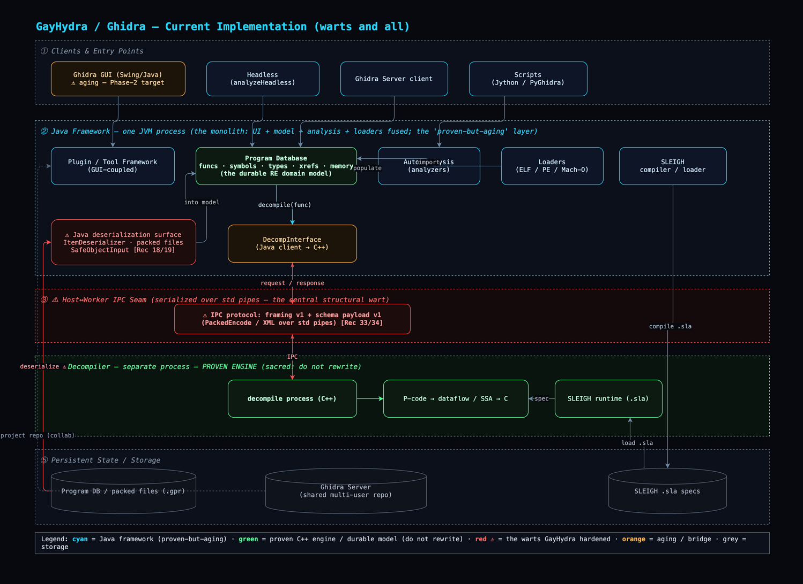
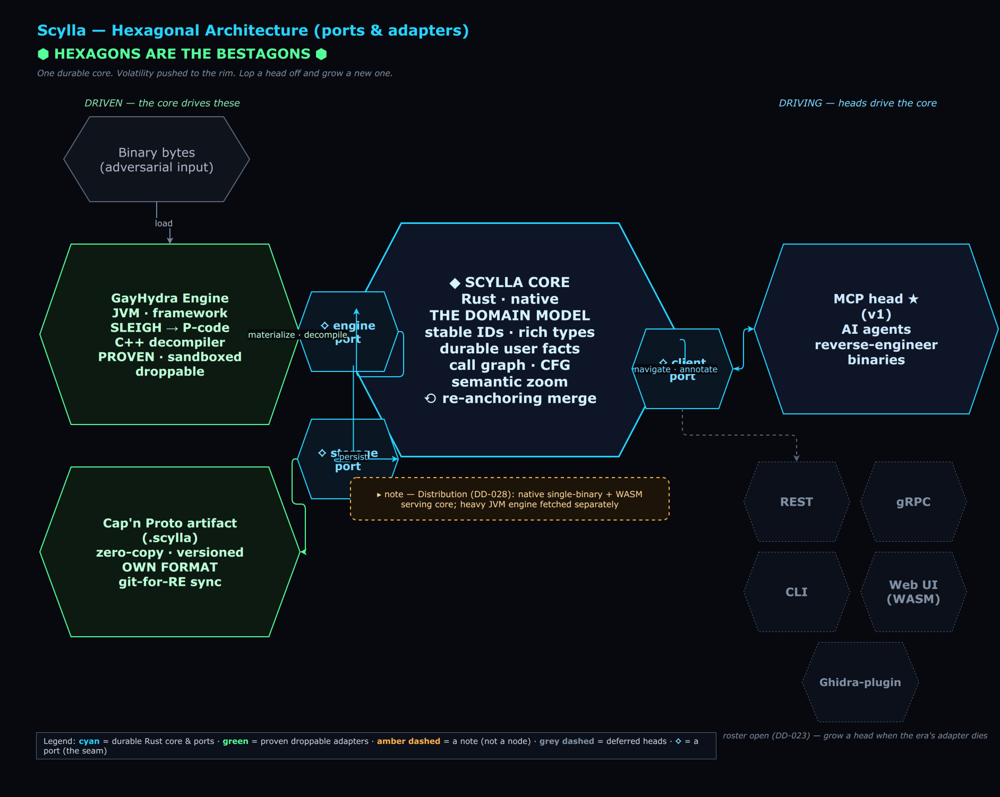

# Scylla

**A hexagonal, adapter-headed reverse-engineering platform.**

  
   <em>▶ Watch the demo</em>

Scylla wraps a proven reverse-engineering engine behind a **durable, transport-agnostic
reverse-engineering domain model** — the *body* — and exposes it through thin,
**disposable protocol adapters** — the *heads*.

Named for the six-headed sea monster of Homer's *Odyssey*: many heads, one immortal
body. Lop a head off and grow a new one. Today there are **six heads** — an MCP server
(so AI agents reverse-engineer binaries directly), a browser/WASM head, a native serving
binary, a terminal CLI, a remote Cap'n Proto RPC head, and an HTTP/JSON gateway — all
projecting the *same* body. When MCP is the CORBA of 2040, you grow a new head and the
body never notices.

## The idea

Reverse-engineering tools fossilize around the universal adapter of their era
(Ghidra is Java-shaped because the JVM was *the* cross-platform answer circa 2000).
You can't pick a technology that survives 20 years — so don't. Pick the right **seam**
and bet on the slowest-moving layer.

In reverse engineering, the slowest-moving layer is the **domain model itself** —
functions, basic blocks, cross-references, types, the call graph, symbols, decompiled
output, annotations. That vocabulary barely moved from IDA in the '90s to Ghidra in
the 2000s to today, and it won't move much in the next 20 years, because it isn't a
technology — it's the *shape of the problem*.

Scylla's architecture (ports-and-adapters / hexagonal):

- **The body** — a clean, minimal, transport-agnostic contract for the RE domain
  model, sitting on top of a proven engine (the engine is sacred; it is never
  rewritten).
- **The heads** — thin, sheddable protocol adapters (MCP first; REST/gRPC/whatever
  next) that project the body to whatever consumer the era demands. Each head is
  ~a few hundred lines and disposable; the body is the only bet you can't take back.

You cannot shim your way out of a bad core, so the design effort goes into the body.
The heads are cheap on purpose.

## Before → After

**Before** — the current GayHydra / Ghidra implementation Scylla refactors away from:
a Java monolith with the UI welded to the framework, the proven C++ decompiler reached
across a brittle serialized IPC seam (warts in red, the proven engine in green):

**After** — the hexagonal target Scylla builds toward: a durable **Rust core** holding the
RE domain model as the system's **narrow waist**, GayHydra demoted to a **droppable proven
engine** behind the engine-port, and disposable polyglot **heads** (MCP first) below the
client-port. The two ⟡ bands are the narrow waists; the model-artifact is the one bet you
can't take back:

The reasoning behind every box is recorded in [DesignDecisions.md](DesignDecisions.md) (all
44 decisions); the build path — prototype-first — is in [SprintPlanning.md](SprintPlanning.md);
what shipped when is in [CHANGELOG.md](CHANGELOG.md).

## The heads

One body — the durable RE domain model (`scylla-model`) and the client port over it
(`scylla-port`) — and **six heads** today, each a thin adapter projecting the *same* verbs
(navigate / annotate / **diff** / merge / export):

- **Browser (WASM)** — `crates/scylla-wasm`: the client port compiled to `wasm32`, so a browser
  navigates / annotates / **diffs** a `.scylla` model-artifact entirely client-side — no server,
  no engine. Renders the call graph as an actual graph, paints a structural diff onto it, searches.
- **Native single binary** — `crates/scylla-serve`: a zero-dependency binary that bakes in the
  browser head and serves it + an artifact over HTTP. `scylla-serve old.scylla new.scylla` opens
  straight onto *what the rebuild changed*.
- **Terminal** — `crates/scylla-cli` (`scylla`): `materialize` a binary via the engine, then
  `diff` / `info` / `functions` / `search` / `view` / `callers` an artifact offline. `scylla diff`
  carries `git diff --exit-code` semantics for CI.
- **AI agents (MCP)** — `crates/scylla-mcp`: an MCP server exposing the port 1:1 as tools
  (list_functions / search / get_function / callers / rename / retype / comment / diff / merge / export),
  so an agent reverse-engineers a binary directly. Binary-derived text is wrapped untrusted (DD-035).
- **Remote (Cap'n Proto RPC)** — `crates/scylla-rpc`: `scylla-rpc-serve` serves the model over TCP
  and `scylla-rpc-connect` drives it from off-box, navigating by **promise-pipelining**
  (`function(id).callers().view()` is one round-trip — the transport the artifact format was chosen
  for, DD-002), annotating (rename/retype/comment) and pulling the result back down (`export`).
  Auth-gated, connection-capped, slow-loris-bounded, TLS-capable.
- **HTTP/JSON gateway** — `crates/scylla-http`: `scylla-http` serves the model as a plain
  HTTP/JSON API (`GET /api/info` / `/api/functions` / `/api/search?q=` / `/api/functions/<id>` / `…/callers`,
  `POST /api/diff`) and lets any client *annotate* it (`POST …/rename` / `…/retype` / `…/comment`)
  then pull the annotated model back as a `.scylla` (`GET /api/export`), so any language, dashboard,
  or `curl` drives the full verb set — including persistence — with no special client.
  Token-gated and TLS-capable, like the RPC head.

The **diff** is a real binary-differ: it pairs functions across two builds by structural identity
(address-independent), then climbs the BinDiff-style ladder — call-graph propagation, unique
strings/imports, BSim feature vectors, mnemonic + ordered-trigram cosine — to report functions
matched / renamed / **modified** / added / removed. Fail-closed throughout: a near-tie is never guessed.

## Status

**Feature-complete core, six working heads.** The durable Rust body (model + client port +
Cap'n Proto model-artifact) is built, with a structural binary-diff engine at parity with the
identity-anchored merge. The heads above all run today over that one body — including a **remote
RPC head** over the Cap'n Proto promise-pipelining surface (DD-002), the transport the format was
chosen for; the heavy JVM engine is reached over gRPC as a droppable producer (DD-009/040). Sibling
project to [GayHydra](https://github.com/CryptoJones/GayHydra) (a hardened fork of NSA Ghidra, which
provides the proven engine Scylla wraps).

## Acknowledgements

Scylla stands on work it has no intention of replacing:

- **[Ghidra](https://github.com/NationalSecurityAgency/ghidra)** (NSA) — the proven
  reverse-engineering engine Scylla wraps, by way of the
  **[GayHydra](https://github.com/CryptoJones/GayHydra)** hardened fork. The engine is
  sacred: Scylla demotes it to a droppable producer behind the engine-port, never rewrites it.
- **[Cap'n Proto](https://capnproto.org)** — the serialization behind the durable
  model-artifact (DD-002). The artifact is the one bet Scylla can't take back, so it rests
  on a format built for schema evolution and bounded, memory-safe reads — and chosen, too,
  for the promise-pipelining RPC the client port will project if a remote head ever needs it.
- **[Protocol Buffers](https://protobuf.dev)** over **[tonic](https://github.com/hyperium/tonic)**
  / **[Prost](https://github.com/tokio-rs/prost)**, on **[Tokio](https://tokio.rs)** — the
  gRPC engine-port seam to the sandboxed JVM engine-as-service (DD-009/040).
- The **[Rust](https://www.rust-lang.org)** project and its crate ecosystem — the language
  of the durable core.

Two serialization IDLs in one tree — Cap'n Proto on the model/client waist, Protocol
Buffers on the engine seam — is a deliberate, documented choice (see DD-002), not an accident.

## License

[Apache License 2.0](LICENSE) © Aaron K. Clark — matching Ghidra (Apache 2.0), the engine Scylla builds on.

---

*Proudly Made in Nebraska. Go Big Red! 🌽 https://xkcd.com/2347/*
